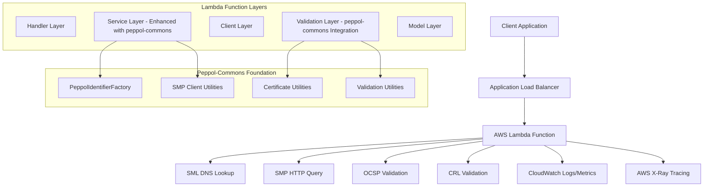

# Design Document

## Overview

The Peppol SML/SMP Lookup Tool is designed as a serverless AWS Lambda function that provides secure, compliant, and high-performance participant lookup services for the Peppol network. The system is built upon the production-proven peppol-commons library as its foundation, adding Lambda-specific optimizations and enhancements while ensuring full Peppol compliance.

The design follows a layered architecture with clear separation of concerns, leveraging peppol-commons for core Peppol functionality while implementing comprehensive security measures and maintaining full compliance with Peppol specifications and W3C standards. This approach significantly reduces implementation risk, accelerates development, and ensures ongoing compliance with evolving Peppol standards.

The design emphasizes security-first principles, performance optimization for Lambda cold starts, comprehensive validation at every layer using peppol-commons utilities, and seamless integration with the existing Peppol ecosystem. The system handles both production and test environments while providing extensive monitoring, error handling, and observability capabilities.

## Architecture

### High-Level Architecture



### Layered Architecture Design

The system implements a clean layered architecture with the following layers:

1. **Handler Layer**: AWS Lambda entry point, request/response handling, and global error management
2. **Service Layer**: Business logic orchestration, workflow coordination, and caching
3. **Client Layer**: External service communication (DNS, HTTP, OCSP, CRL)
4. **Validation Layer**: Comprehensive validation logic for certificates, XML, and compliance
5. **Model Layer**: Data models, DTOs, and internal representations

### Security Architecture


## Components and Interfaces

### Handler Layer Components

#### PeppolLookupHandler
- **Purpose**: Main AWS Lambda entry point
- **Responsibilities**: 
  - Request deserialization and validation
  - Response serialization and error handling
  - Request correlation ID generation
  - Security header validation
- **Key Methods**:
  - `handleRequest(APIGatewayProxyRequestEvent, Context): APIGatewayProxyResponseEvent`
  - `validateRequest(LookupRequest): ValidationResult`
  - `buildResponse(LookupResult): APIGatewayProxyResponseEvent`

#### RequestValidator
- **Purpose**: Comprehensive input validation using peppol-commons
- **Responsibilities**:
  - Participant ID format validation using PeppolIdentifierFactory
  - Document type and process ID validation using peppol-commons
  - Input sanitization and XSS prevention
  - Length and character set validation
  - Peppol compliance validation
- **Key Methods**:
  - `validateParticipantId(String): ValidationResult`
  - `validateDocumentType(String): ValidationResult`
  - `sanitizeInput(String): String`
- **Peppol-Commons Integration**:
  - Uses `PeppolIdentifierFactory.createParticipantIdentifierWithDefaultScheme()`
  - Leverages peppol-commons identifier validation utilities

### Service Layer Components

#### SmlLookupService
- **Purpose**: SML DNS resolution with proper MD5 hashing
- **Responsibilities**:
  - MD5 hash calculation (NOT SHA-256)
  - DNS query construction (B-{hex}.{scheme}.{sml-domain})
  - DNS resolution with retry logic
  - DNSSEC validation when available
- **Key Methods**:
  - `lookupSmp(String participantId, String environment): SmlResult`
  - `calculateMd5Hash(String participantId): String`
  - `constructDnsQuery(String hash, String scheme, String domain): String`

#### SmpQueryService
- **Purpose**: SMP HTTP queries and XML processing using peppol-commons foundation
- **Responsibilities**:
  - SMP URL construction and HTTP requests with peppol-commons identifier validation
  - Secure XML parsing with XXE protection
  - Certificate extraction from XML using peppol-commons utilities
  - XML signature preservation for validation
  - Integration with peppol-commons SMP client capabilities
- **Key Methods**:
  - `querySmp(String smpUrl, String participantId, String documentType): SmpResult`
  - `parseSecureXml(String xmlContent): SmpMetadata`
  - `extractCertificate(Element xmlElement): X509Certificate`
- **Peppol-Commons Integration**:
  - Uses `PeppolIdentifierFactory` for identifier validation
  - Leverages peppol-commons SMP data structures where applicable

#### ValidationOrchestrator
- **Purpose**: Coordinates all validation processes
- **Responsibilities**:
  - Validation workflow orchestration
  - Result aggregation and reporting
  - Validation caching and optimization
  - Compliance assessment
- **Key Methods**:
  - `validateComplete(SmpResult, ValidationOptions): ValidationResults`
  - `orchestrateValidations(ValidationContext): ComprehensiveValidation`

#### CertificateService
- **Purpose**: Certificate processing and conversion
- **Responsibilities**:
  - DER to PEM conversion
  - Certificate chain building
  - Certificate metadata extraction
  - Certificate caching
- **Key Methods**:
  - `convertDerToPem(byte[] derData): String`
  - `buildCertificateChain(X509Certificate cert): List<X509Certificate>`
  - `extractCertificateDetails(X509Certificate cert): CertificateDetails`

#### CircuitBreakerService
- **Purpose**: External service failure protection
- **Responsibilities**:
  - Circuit breaker pattern implementation
  - Failure threshold monitoring
  - Service health tracking
  - Graceful degradation
- **Key Methods**:
  - `executeWithCircuitBreaker(Supplier<T> operation, String serviceName): T`
  - `recordSuccess(String serviceName): void`
  - `recordFailure(String serviceName): void`

### Client Layer Components

#### DnsClient
- **Purpose**: DNS resolution with security features
- **Responsibilities**:
  - Secure DNS resolution
  - DNSSEC validation
  - DNS over HTTPS support
  - DNS result caching
- **Configuration**:
  - 10-second timeout
  - 3 retry attempts with exponential backoff
  - DNSSEC validation enabled
- **Key Methods**:
  - `resolveCname(String domain): String`
  - `validateDnssec(String domain): boolean`

#### HttpClient
- **Purpose**: HTTP/HTTPS communication with SMP services
- **Responsibilities**:
  - HTTP/2 support with fallback to HTTP/1.1
  - Connection pooling across Lambda invocations
  - SSL/TLS certificate validation
  - Request/response timeout handling
- **Configuration**:
  - 30-second HTTP timeout
  - Connection pooling enabled
  - Secure cipher suites only
- **Key Methods**:
  - `get(String url, Map<String, String> headers): HttpResponse`
  - `validateSslCertificate(String url): boolean`

#### OcspClient
- **Purpose**: OCSP certificate revocation checking
- **Responsibilities**:
  - OCSP request construction
  - OCSP response validation
  - Rate limiting and caching
  - Graceful failure handling
- **Configuration**:
  - 10-second timeout
  - Response caching (validity period based)
  - Rate limiting protection
- **Key Methods**:
  - `checkRevocationStatus(X509Certificate cert): OcspResult`
  - `buildOcspRequest(X509Certificate cert): OCSPReq`

#### CrlClient
- **Purpose**: CRL download and processing
- **Responsibilities**:
  - CRL download from distribution points
  - CRL signature validation
  - CRL caching with TTL
  - Revocation status checking
- **Key Methods**:
  - `downloadCrl(String crlUrl): X509CRL`
  - `validateCrlSignature(X509CRL crl): boolean`
  - `checkRevocation(X509Certificate cert, X509CRL crl): boolean`

### Validation Layer Components

#### CertificateValidator
- **Purpose**: Comprehensive RFC 5280 certificate validation
- **Responsibilities**:
  - Certificate chain validation
  - Signature verification
  - Validity period checking
  - Key usage validation
  - Peppol-specific policy validation
- **Key Methods**:
  - `validateCertificateChain(List<X509Certificate> chain): ValidationResult`
  - `validatePeppolCompliance(X509Certificate cert): ValidationResult`
  - `validateKeyUsage(X509Certificate cert): ValidationResult`

#### XmlSignatureValidator
- **Purpose**: W3C XML Signature validation
- **Responsibilities**:
  - XML signature extraction
  - Canonical XML 1.0 processing (CRITICAL)
  - Signature algorithm validation
  - Reference validation
- **Key Methods**:
  - `validateXmlSignature(Document xmlDoc): ValidationResult`
  - `canonicalizeXml(Node node): String`
  - `validateSignatureAlgorithm(String algorithm): boolean`

#### EndpointValidator
- **Purpose**: Endpoint and transport profile validation
- **Responsibilities**:
  - Transport profile validation
  - Endpoint URL validation
  - HTTPS enforcement
  - Optional connectivity testing
- **Key Methods**:
  - `validateTransportProfile(String profile): ValidationResult`
  - `validateEndpointUrl(String url): ValidationResult`
  - `testConnectivity(String url): ValidationResult`

#### SecurityValidator
- **Purpose**: Overall security validation
- **Responsibilities**:
  - Cryptographic algorithm validation
  - Key length enforcement
  - Security policy compliance
  - Threat detection
- **Key Methods**:
  - `validateCryptographicStrength(X509Certificate cert): ValidationResult`
  - `validateSecurityPolicies(ValidationContext context): ValidationResult`

## Peppol-Commons Integration Strategy

### Foundation Libraries

The system leverages the following peppol-commons libraries:

- **peppol-commons**: Core Peppol functionality and utilities
- **peppol-smp-client**: SMP client capabilities and data structures  
- **peppol-id**: Identifier handling and validation

### Integration Approach

#### Wrapper Pattern
The system implements a wrapper pattern around peppol-commons functionality:
- Core peppol-commons classes provide the foundation
- Lambda-specific wrapper services add AWS optimizations
- Enhanced error handling and monitoring capabilities
- Custom caching and performance optimizations

#### Hybrid Architecture
- **Core Peppol Logic**: Handled by peppol-commons (identifier validation, SMP parsing, certificate handling)
- **Lambda Optimizations**: Custom implementations for AWS-specific requirements (connection pooling, caching, monitoring)
- **Security Enhancements**: Additional security layers while maintaining peppol-commons compliance

#### Benefits
- **Reduced Risk**: Leverages battle-tested, production-proven code
- **Compliance Assurance**: Built-in Peppol specification compliance
- **Faster Development**: Focus on Lambda-specific enhancements rather than core Peppol functionality
- **Maintainability**: Automatic updates to Peppol standards through library updates

## Data Models

### Request Models

#### LookupRequest
```java
public class LookupRequest {
    @NotNull @Pattern(regexp = PEPPOL_PARTICIPANT_PATTERN)
    private String participantId;
    
    @NotNull @Pattern(regexp = PEPPOL_DOCUMENT_TYPE_PATTERN)
    private String documentTypeId;
    
    @NotNull @Pattern(regexp = PEPPOL_PROCESS_PATTERN)
    private String processId;
    
    @NotNull @Pattern(regexp = "^(production|test)$")
    private String environment;
    
    private boolean validateEndpointConnectivity = false;
    private boolean includeFullCertificateChain = false;
    private boolean includeTechnicalDetails = false;
    
    @Size(max = 100)
    private String requestId;
}
```

### Response Models

#### LookupResponse
```java
public class LookupResponse {
    private boolean success;
    private String participantId;
    private String endpointUrl;
    private String transportProfile;
    private String certificate;
    private List<String> certificateChain;
    private Instant serviceActivationDate;
    private Instant serviceExpirationDate;
    private ValidationResults validationResults;
    private CertificateDetails certificateDetails;
    private TechnicalDetails technicalDetails;
    private List<ErrorDetail> errors;
    private String requestId;
    private long processingTimeMs;
    private Instant timestamp;
}
```

#### ValidationResults
```java
public class ValidationResults {
    // Certificate Validation
    private boolean certificateValid;
    private boolean certificateNotExpired;
    private boolean certificateNotRevoked;
    private boolean certificateFromOpenPeppol;
    private boolean certificateChainValid;
    private boolean certificateKeyLengthValid;
    private boolean certificatePolicyValid;
    
    // XML Signature Validation
    private boolean smpSignatureValid;
    private boolean xmlCanonicalizationValid;
    private boolean signatureAlgorithmValid;
    
    // Endpoint Validation
    private boolean endpointAccessible;
    private boolean transportProfileSupported;
    private boolean serviceAvailable;
    
    // Revocation Validation
    private boolean crlCheckPassed;
    private boolean ocspCheckPassed;
    
    // DNS Validation
    private boolean smlDnsResolutionSuccessful;
    private boolean dnsSecValid;
    private boolean smpAccessible;
    
    // Compliance Validation
    private boolean peppolCompliant;
    private boolean productionNetworkCompliant;
}
```

### Internal Models

#### SmlResult
```java
public class SmlResult {
    private String smpUrl;
    private String dnsQuery;
    private String md5Hash;
    private long resolutionTimeMs;
    private boolean dnssecValid;
    private List<String> intermediateResults;
}
```

#### SmpResult
```java
public class SmpResult {
    private String endpointUrl;
    private String transportProfile;
    private X509Certificate certificate;
    private Instant serviceActivationDate;
    private Instant serviceExpirationDate;
    private Document xmlDocument;
    private String xmlSignature;
    private long queryTimeMs;
}
```

## Error Handling

### Error Classification System

The system implements a comprehensive error classification system with structured error codes:

- **E1xxx**: SML-related errors (DNS resolution, hash calculation)
- **E2xxx**: SMP-related errors (HTTP communication, XML parsing)
- **E3xxx**: Certificate-related errors (validation, revocation)
- **E4xxx**: Network-related errors (timeouts, connectivity)
- **E5xxx**: Validation-related errors (compliance, format)
- **E6xxx**: External service errors (OCSP, CRL)
- **E7xxx**: Input validation errors
- **E8xxx**: System errors (configuration, internal)

### Error Response Structure

```java
public class ErrorDetail {
    private String code;
    private String category;
    private String severity;
    private String message;
    private String technicalDetails;
    private boolean retryable;
    private Instant timestamp;
    private String helpUrl;
    private Map<String, Object> additionalContext;
}
```

### Circuit Breaker Configuration

- **Failure Threshold**: 5 consecutive failures
- **Recovery Timeout**: 60 seconds
- **Half-Open State**: Allow 3 test requests
- **Success Threshold**: 2 consecutive successes to close circuit

## Testing Strategy

### Unit Testing Approach

- **Coverage Target**: Minimum 90% code coverage
- **Mocking Strategy**: Mock all external dependencies using Mockito
- **Test Categories**:
  - Happy path scenarios
  - Error path scenarios
  - Edge cases and boundary conditions
  - Security validation tests
  - Performance tests

### Integration Testing Approach

- **Test Environment**: Peppol test network
- **Test Scenarios**:
  - End-to-end lookup workflows
  - Certificate chain validation
  - XML signature validation
  - Network failure scenarios
  - Timeout handling

### Security Testing Approach

- **Input Validation**: Test with malicious payloads
- **XML Security**: Test against XXE, XML bomb attacks
- **Certificate Testing**: Test with malformed, expired, revoked certificates
- **Network Security**: Test SSL/TLS configuration

### Performance Testing

- **Cold Start Optimization**: Measure and optimize Lambda cold start times
- **Memory Usage**: Monitor and optimize memory consumption
- **Throughput Testing**: Test concurrent request handling
- **External Service Performance**: Monitor external service response times

## Deployment Architecture

### AWS Lambda Configuration

- **Runtime**: Java 17 on Amazon Linux 2
- **Memory**: 512MB (initial allocation, monitor for optimization)
- **Timeout**: 60 seconds maximum
- **SnapStart**: Enabled for reduced cold start times
- **Environment Variables**: All configuration via environment variables
- **IAM Role**: Minimal permissions (CloudWatch Logs write only)

### Environment Configuration

```yaml
Production:
  SML_DOMAIN: edelivery.tech.ec.europa.eu
  LOG_LEVEL: INFO
  CACHE_TTL: 3600
  CIRCUIT_BREAKER_ENABLED: true

Test:
  SML_DOMAIN: acc.edelivery.tech.ec.europa.eu
  LOG_LEVEL: DEBUG
  CACHE_TTL: 1800
  CIRCUIT_BREAKER_ENABLED: true
```

### Monitoring and Observability

#### CloudWatch Metrics
- Business metrics: Success/failure rates, processing times
- Performance metrics: SML lookup time, SMP query time, validation time
- Error metrics: Error rates by category, retry rates
- Resource metrics: Memory usage, CPU utilization

#### CloudWatch Alarms
- Error rate > 5% over 5-minute window
- P99 latency > 30 seconds
- Certificate expiry within 30 days
- External service availability drops

#### AWS X-Ray Tracing
- Complete request flow tracing
- External service call tracing
- Performance bottleneck identification
- Error flow analysis

This design provides a robust, secure, and compliant foundation for the Peppol SML/SMP Lookup Tool while maintaining high performance and comprehensive observability.